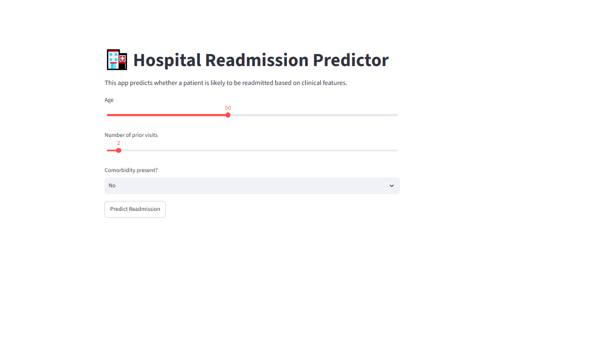

🏥 Hospital Readmission Prediction
📌 Project Overview
Hospital readmissions are a major global challenge — costing US hospitals $26B annually and wasting scarce beds in Nigeria.
This project builds a Logistic Regression pipeline to predict readmission risk, and wraps it in a deployable app stack.

It combines:

Machine Learning (Logistic Regression) trained in Google Colab

Flask API for serving predictions

React Frontend for user interaction

Streamlit App for quick demo and visualization

Saved Models + Preprocessor for deployment‑ready reproducibility

📂 Repository Structure
backend/ → Flask API + saved models (readmission_model.pkl, preprocessor.pkl)

notebooks/ → Colab training notebook (hospital_readmissions.ipynb)

app.py → Streamlit app interface

images/ → Screenshots of the app

README.md → Project documentation

🚀 How to Run
1. Clone the repository
bash
git clone https://github.com/KelechiFrancisca/hospital-readmission-api.git
cd "hospital-readmission-api"
2. Backend (Flask API)
bash
cd backend
pip install -r requirements.txt
python run_readmission.py
3. Notebook (Model Training)
Open notebooks/hospital_readmissions.ipynb in Google Colab to retrain the model if needed.

4. Streamlit App (Interactive Demo)
bash
streamlit run app.py
This will open the app in your browser at http://localhost:8501.

📊 Model Performance
Logistic Regression Accuracy: ~85% (depending on dataset split)

Stratified train/test split to handle class imbalance

Confusion Matrix + Classification Report included

Feature Importance: Top risk factors (e.g., number of medications, age group) extracted from coefficients

🌍 Deployment
Backend serves predictions via /predict endpoint

Frontend provides a dashboard for users

Streamlit App offers a lightweight demo interface

Ready for deployment on Render, Heroku, or Streamlit Cloud

💡 Impact
Problem: 30‑day readmissions cost billions and waste hospital resources.

Solution: Predictive model to flag high‑risk patients early.

Impact: Hospitals can intervene sooner, saving lives and reducing costs.

📸 Screenshots
## 📸 Screenshots
### Streamlit App Interface

👥 Contributors
Kelechi Francisca (Lead Developer, Data Scientist)

🔮 Future Work
This project is designed with long‑term impact in mind, extending well beyond its initial demonstration:

Hospital workflow integration  
Embed predictions into discharge planning to flag high‑risk patients and schedule timely follow‑ups.

Healthcare cost reduction  
Help hospitals avoid Medicare/insurance penalties and reduce billions in readmission costs.

Patient‑centered care  
Extend the model to include social determinants of health (housing, food security, isolation) for more accurate predictions.

Policy and public health  
Governments and health systems could adopt predictive tools to monitor hospital performance and improve national outcomes.

Technology expansion  
Integrate with electronic health records (EHRs) via HL7 FHIR APIs, deploy on cloud platforms, or create mobile apps for patient reminders.