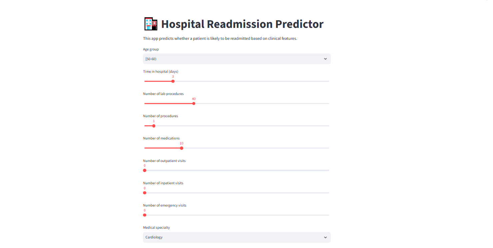
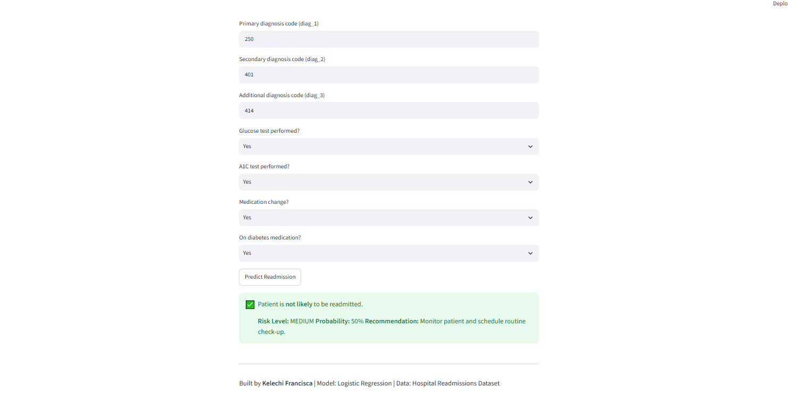

# 🏥 Hospital Readmission Prediction


🔗 Live Demo
👉 Hospital Readmission Predictor on Render (https://hospital-readmission-api-s2q8.onrender.com)
    The app is hosted on Render, with free tier limitations (it may spin down after inactivity).     


## 🔗 Live Demo
👉 [Hospital Readmission Predictor on Render](https://hospital-readmission-api-s2q8.onrender.com)

---


## 📌 Project Overview
Hospital readmissions are a major global challenge — costing US hospitals **$26B annually** and wasting scarce beds in Nigeria.  
This project builds a **Logistic Regression pipeline** to predict readmission risk, and wraps it in a deployable app stack.

It combines:
- Machine Learning (Logistic Regression) trained in Google Colab  
- Streamlit App for interactive demo and visualization  
- Saved Models + Preprocessor for deployment‑ready reproducibility  
- Backend folder with Flask API (optional, for REST endpoints)  

---


## 📂 Repository Structure
- `backend/` → Flask API + saved models (`readmission_model.pkl`, `preprocessor.pkl`)  
- `notebooks/` → Colab training notebook (`hospital_readmissions.ipynb`)  
- `app.py` → Streamlit app interface (latest demo)  
- `images/` → Screenshots of the app  
- `README.md` → Project documentation  

---


## 🚀 How to Run
1. Clone the repository  
   ```bash
   git clone https://github.com/KelechiFrancisca/hospital-readmission-api.git
   cd hospital-readmission-api
Install dependencies

bash
pip install -r requirements.txt
Run the Streamlit App (Interactive Demo)

bash
streamlit run app.py
Opens at: http://localhost:8501

(Optional) Run the Flask API:

bash
cd backend
python run_readmission.py
📊 Model Performance
Logistic Regression Accuracy: ~85% (depending on dataset split)

Stratified train/test split to handle class imbalance

Confusion Matrix + Classification Report included

Feature Importance: top risk factors (e.g., number of medications, age group) extracted from coefficients


🛠 Tech Stack
Python (pandas, scikit‑learn, joblib)

Streamlit (interactive demo app)

Flask (optional backend API)

Google Colab (model training)

Render / Streamlit Cloud (deployment)


🌍 Deployment
Streamlit App offers a lightweight demo interface

Backend API serves predictions via /predict endpoint

Ready for deployment on Render, Heroku, or Streamlit Cloud


💡 Impact
Problem: 30‑day readmissions cost billions and waste hospital resources.
Solution: Predictive model to flag high‑risk patients early.
Impact:

Hospitals can intervene sooner, saving lives and reducing costs.

Predictive analytics integrated into clinical workflows can reduce readmissions by 15–30%.

Potential to save billions in healthcare costs annually.

Improves patient outcomes through proactive follow‑up care.


📸 Screenshots
### Streamlit App Inputs


### Prediction Result



👥 Contributors
Kelechi Francisca (Lead Developer, Data Scientist)


🔮 Future Work & Roadmap
This project is designed with long‑term impact in mind, extending well beyond its initial demonstration:

API Layer → Wrap the model in a REST API (FastAPI/Flask) for automated data exchange.

EHR Integration → Connect via HL7/FHIR APIs so predictions appear inside Epic, Cerner, or other hospital dashboards.

Workflow Embedding → Add alerts for high‑risk patients during discharge planning and notify case managers automatically.

Population Health Dashboard → Aggregate predictions across patients to identify trends and allocate resources strategically.

Compliance & Security → Ensure HIPAA/GDPR compliance with authentication, audit logs, and secure hosting.

Healthcare Cost Reduction → Help hospitals avoid Medicare/insurance penalties and reduce billions in readmission costs.

Patient‑Centered Care → Extend the model to include social determinants of health (housing, food security, isolation).

Policy & Public Health → Governments and health systems could adopt predictive tools to monitor hospital performance.

Technology Expansion → Deploy on cloud platforms, integrate with EHRs, or create mobile apps for patient reminders.

Technology expansion → Integrate with EHRs via HL7 FHIR APIs, deploy on cloud platforms, or create mobile apps for patient reminders

